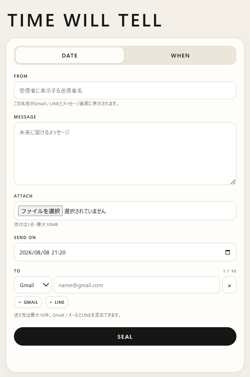

# TIME WILL TELL

**A message sealed by time.**

TIME WILL TELL is a small web app for writing a message now and making it readable later. The message is sealed until a specified date/time, or released when a chosen condition is triggered.



## Concept

Time itself is the key.

- **DATE** — seal a message until a specified date and time.
- **WHEN** — seal a message until a condition is fulfilled and its trigger is activated.
- Recipients do not need to install the app. They receive a browser link.
- Gmail/email and LINE recipients can be mixed in one message.
- The opened message shows the sender name and the date it was sealed: `SEALED — YYYY.MM.DD`.

## Current version

**v0.1.7**

### v0.1.7

- Added `SEALED — YYYY.MM.DD` to the opened-message view.
- Gmail delivery uses the Gmail API with a dedicated sender account.
- Gmail OAuth requests `gmail.send` for mailbox access; it does not request Gmail read access.
- LINE delivery uses LINE Messaging API + LINE Login.
- Up to 10 recipients per message.
- One attachment up to 10 MB.
- PWA support.

## Architecture

- **Cloudflare Workers** — application/API runtime
- **Cloudflare D1** — encrypted message metadata and recipient state
- **Cloudflare R2** — encrypted attachments
- **Cloudflare Cron Triggers** — scheduled release/delivery checks
- **Gmail API** — email delivery
- **LINE Messaging API / LINE Login** — LINE delivery and recipient connection

Message bodies, sender names, conditions, OAuth refresh-token data and attachments are encrypted before storage using the configured `CONTENT_SECRET`.

## Project structure

```text
TIME-WILL-TELL/
├─ src/
│  └─ worker.js
├─ public/
│  ├─ index.html
│  ├─ app.js
│  ├─ styles.css
│  ├─ sw.js
│  ├─ manifest.webmanifest
│  └─ icon.svg
├─ migrations/
│  ├─ 0001_init.sql
│  ├─ 0002_sender_name.sql
│  └─ 0003_app_settings.sql
├─ assets/
│  └─ screenshot.svg
├─ wrangler.jsonc
├─ package.json
└─ DEPLOY_JA.md
```

## Gmail permissions

The Gmail integration is intentionally narrow. For Gmail mailbox access, TIME WILL TELL requests:

```text
https://www.googleapis.com/auth/gmail.send
```

The app uses OpenID/email identity scopes only to confirm which Google account completed the connection. It does not request Gmail inbox-reading scopes such as `gmail.readonly`, `gmail.modify`, or full mailbox access.

## Setup

See **[DEPLOY_JA.md](DEPLOY_JA.md)** for the Cloudflare, Gmail API, and LINE setup flow.

Do not commit real secrets. Store credentials with Wrangler secrets, for example:

```powershell
npx wrangler@latest secret put CONTENT_SECRET
npx wrangler@latest secret put RATE_SALT
npx wrangler@latest secret put GMAIL_CLIENT_ID
npx wrangler@latest secret put GMAIL_CLIENT_SECRET
```

## Live app

https://time-will-tell.1bitexist.workers.dev/

## Author

Masato Nasu

## License

See [LICENSE](LICENSE).
