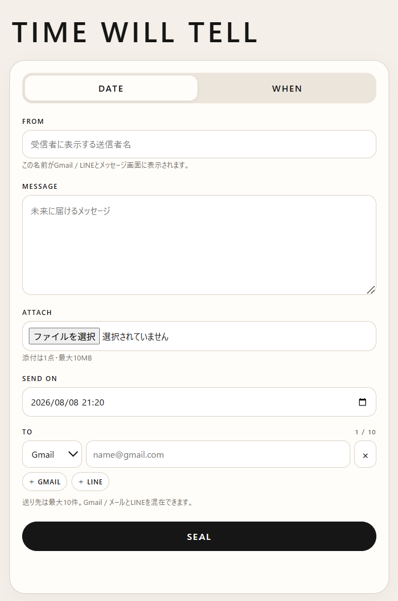

# TIME WILL TELL

**A message sealed by time.**

TIME WILL TELL is a web app for writing a message now and making it readable later. Time itself acts as the key: a message stays sealed until its scheduled moment arrives, or until a chosen condition is triggered.



## Concept

Write now. Open later.

- **DATE** — choose an exact date and time for delivery.
- **WHEN** — release a message when a chosen condition is fulfilled and its trigger is activated.
- **FROM** — set the sender name shown to the recipient.
- **MESSAGE** — write the message to be delivered in the future.
- **ATTACH** — attach one file up to 10 MB. Image attachments are shown directly in the opened message.
- **TO** — add Gmail/email and LINE recipients in the same message, up to 10 recipients total.
- **SEAL** — lock the message into its delivery rule.

Recipients do not need to install the app. They receive a browser link, email, or LINE delivery depending on the selected destination.

When a sealed message is opened, the message view shows the sender name and the date it was sealed:

```text
SEALED — YYYY.MM.DD
```

## Current version

**v0.1.10**

### v0.1.10

- Image attachments are displayed inline in the opened-message view instead of forcing a download.
- Images still have a **DOWNLOAD IMAGE** button; other files use **DOWNLOAD FILE**.
- After the browser successfully starts a download, the button changes to **DOWNLOADED ✓**.
- The same attachment behavior is used by the iPhone-safe server-rendered `/m/TOKEN` message page.
- Reusable LINE recipients from v0.1.9 remain supported: after the first LINE connection, future scheduled messages can be sent without another pre-registration link.
- Gmail delivery uses the Gmail API with a dedicated sender account.
- Gmail OAuth requests `gmail.send` for mailbox access; it does not request Gmail read access.
- LINE delivery uses LINE Messaging API + LINE Login.
- Gmail/email and LINE recipients can be mixed in one message.
- Up to 10 recipients per message.
- One attachment up to 10 MB.
- PWA support.

## LINE delivery flow

For a new LINE recipient:

1. Create the message and choose **LINE**.
2. Enter the recipient name and **SEAL**.
3. Send the generated LINE connection link to that person once.
4. The recipient completes LINE Login / friend connection.

After that first connection, the recipient appears in the sender browser as a saved LINE recipient. Future messages can simply select that recipient and **SEAL**; TIME WILL TELL sends the LINE message automatically when the scheduled time arrives.

Saved-recipient selection is stored in that browser. Clearing site data or switching browsers/devices removes the local saved list, although the server-side LINE connection remains registered.

## Attachment behavior

Supported image types such as JPEG, PNG, GIF, WebP, AVIF, HEIC, and HEIF are rendered inside the message page. The original file can still be downloaded explicitly.

The **DOWNLOADED ✓** state means the browser successfully fetched the attachment and started the client-side save/download action. A web page cannot reliably confirm the final filesystem destination or OS-level save completion.

## Architecture

- **Cloudflare Workers** — application/API runtime
- **Cloudflare D1** — encrypted message metadata, recipient state, and reusable LINE contact mapping
- **Cloudflare R2** — encrypted attachments
- **Cloudflare Cron Triggers** — scheduled release/delivery checks
- **Gmail API** — email delivery
- **LINE Messaging API / LINE Login** — LINE delivery and recipient connection

Message bodies, sender names, conditions, OAuth refresh-token data and attachments are encrypted before storage using the configured `CONTENT_SECRET`.

## Project structure

```text
TIME-WILL-TELL/
├─ src/
│  ├─ worker.js
│  └─ entry-v019.js
├─ public/
│  ├─ index.html
│  ├─ app.js
│  ├─ styles.css
│  ├─ sw.js
│  ├─ manifest.webmanifest
│  └─ icon.svg
├─ migrations/
│  ├─ 0001_init.sql
│  ├─ 0002_sender_name.sql
│  └─ 0004_reusable_line_contacts.sql
├─ assets/
│  └─ screenshot1.png
├─ wrangler.jsonc
├─ package.json
└─ DEPLOY_JA.md
```

## Gmail permissions

The Gmail integration is intentionally narrow. For Gmail mailbox access, TIME WILL TELL requests:

```text
https://www.googleapis.com/auth/gmail.send
```

The app uses OpenID/email identity scopes only to confirm which Google account completed the connection. It does not request Gmail inbox-reading scopes such as `gmail.readonly`, `gmail.modify`, or full mailbox access.

## Setup

See **[DEPLOY_JA.md](DEPLOY_JA.md)** for the Cloudflare, Gmail API, and LINE setup flow.

Do not commit real secrets. Store credentials with Wrangler secrets, for example:

```powershell
npx wrangler@latest secret put CONTENT_SECRET
npx wrangler@latest secret put RATE_SALT
npx wrangler@latest secret put GMAIL_CLIENT_ID
npx wrangler@latest secret put GMAIL_CLIENT_SECRET
```

## Live app

https://time-will-tell.1bitexist.workers.dev/

## Author

Masato Nasu

## License

See [LICENSE](LICENSE).
